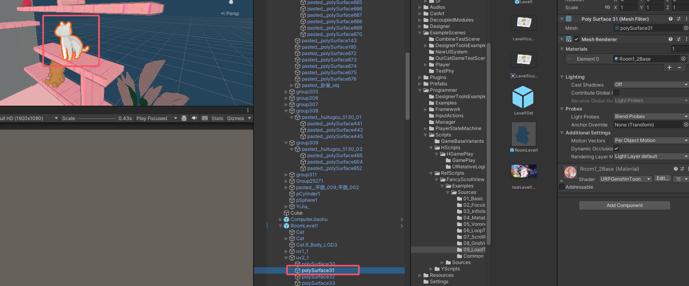
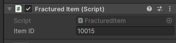
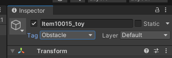
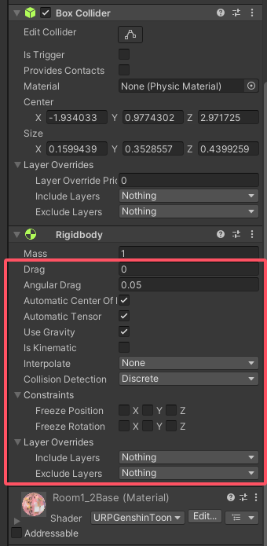
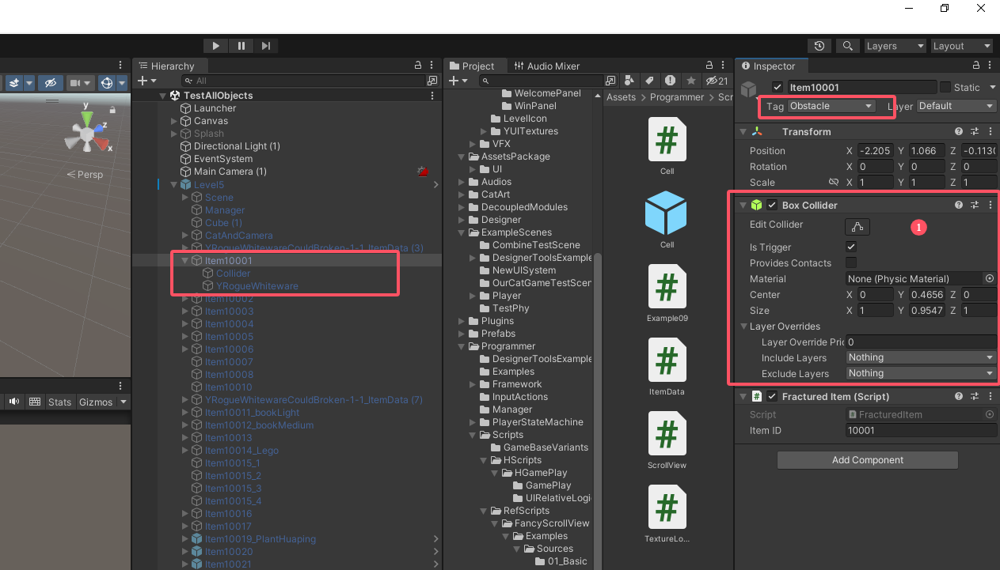
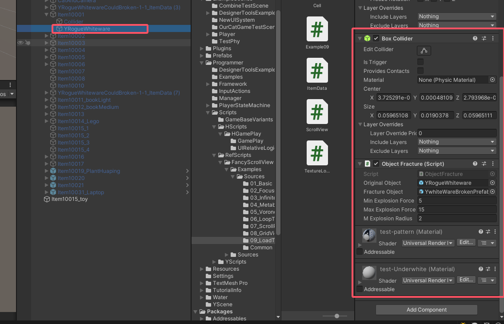
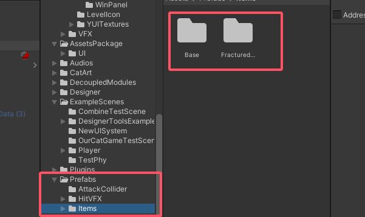

# 猫猫游戏——道具类说明

## 1.先拿美术场景中的某个物体出来：

复制一份出来，命名为Item100xx_名字，比如这个可以叫做Item10015_toy（具体的id在策划表CatgameCommonItem.csv当中）。然后添加如下的东西：

## 2.添加基本组件

### （1）对于可交互的物体，添加FracturedItem脚本，设置ID为策划表中的ID：

（其他的也是类似，比如电脑的脚本是hh做的，yy可以先不弄，普通的绑好Fractured就行）。

------

### （2）设置tag为obstacle

这一步是因为我们要做猫身体碰到的逻辑，需要指定Tag是Obstacle

------

### （3）添加collider和rigidbody

注意：rigidbody的mass属性是从策划表当中读取的，不需要手动设置，但如果物体有特殊的表现（比如轻飘飘的纸），则可以手动修改Drag等属性的值，这个不会被策划表修改。

------

### （4）补充：Fractured

如果是要破碎的物体，这里做一下补充：

①所示的box collider不是必须的，暂时来说这个只做message提示用，方便程序测试，不挂载的话应当不影响（如果有影响再说）

可被破坏子物体的脚本绑定：

==对于其他类型的物体来说，也是类似，依据情况来扩展，但基本就是这个思路。==

### （5）存成Prefab并替换场景模型

将做完的Prefab放置在Prefabs->Items文件夹当中：

### （6）进入关卡的Prefab，替换原有资产为预制体Prefab并保存

